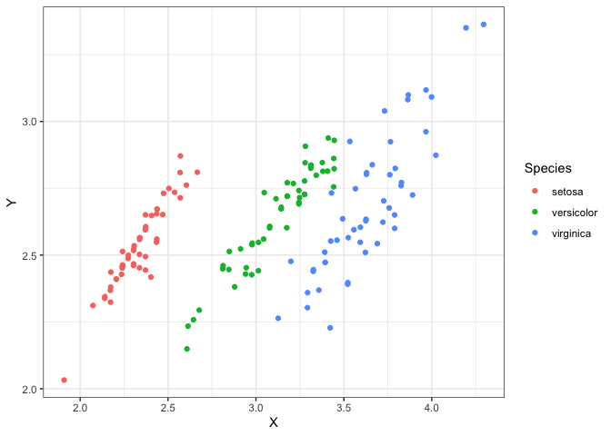

<!-- README.md is generated from README.Rmd. Please edit that file -->

# dlm

<!-- badges: start -->

[](https://www.tidyverse.org/lifecycle/#experimental)
<!-- badges: end -->

The goal of dlm is to …

## Installation

You can install the development version of this package from
[GitHub](https://github.com/) with:

``` r
# install.packages("devtools")
devtools::install_github("kaneplusplus/dlm")
```

## Regression onto a categorical variable

``` r
library(keras)
library(dlm)

# Regress iris variables onto Species (categorical) and get the accuracy.
fit_dlmcat <- dlr(iris, Species ~ ., hidden_layers = 16)
sum(iris$Species == dlr_predict(iris, fit_dlmcat)) / nrow(iris)
#> [1] 0.7466667
```

## Regression onto a continous variable

``` r
# Regress iris variables onto Sepal.Length using a linear model and get the 
# in-sample prediction accuracy.
fit_linear <- lm(Sepal.Length ~ ., iris)
sd(predict(fit_linear, iris))
#> [1] 0.7711747

# Perform the same operation with a deep learner with two hidden layers
# with 24 and 2 nodes respectively.
fit_dlmc <- dlr(iris, Sepal.Length ~., hidden_layers = c(24, 2))
sd(iris$Sepal.Length - dlr_predict(iris, fit_dlmc))
#> [1] 0.3224505
```

## Visualize the iris data in latent position from the first regression

``` r
library(ggplot2)
library(dplyr)
#> 
#> Attaching package: 'dplyr'
#> The following objects are masked from 'package:stats':
#> 
#>     filter, lag
#> The following objects are masked from 'package:base':
#> 
#>     intersect, setdiff, setequal, union

iris %>% 
  latent_space_embedding(fit_dlmc) %>%
  `colnames<-`(c("X", "Y")) %>%
  as_tibble() %>%
  mutate(Species = iris$Species) %>%
  ggplot(aes(x = X, y = Y, color = Species)) +
    geom_point() +
    theme_bw()
```


